[](https://raw.githubusercontent.com/Morgan-Stanley/Xpedite/master/LICENSE.md)
[](https://github.com/morganstanley/Xpedite/actions/workflows/main.yml)
[](https://codecov.io/gh/MorganStanley/Xpedite)

# Xpedite

A non-sampling profiler, purpose built to measure and optimise, performance of ultra-low-latency / real time systems.

The main features include
  
  1. **Targeted Profiling** - Quantify how efficiently a section of code, runs in any Intel CPU and how much head room is left for further optimizations.
  2. **PMU counters** - Capture hundreds of processor specific performance counters like cache/TLB misses, CPU Stalls, NUMA remote access, context switches, etc.
  3. **Cycles accounting** - Find percent of retiring vs stalled cpu cycles with [Topdown micro architecture analysis](https://ieeexplore.ieee.org/document/6844459).
  4. **Optimization heuristics** - Narrow down cpu bottlenecks, with potential for maximum application speed up.
  5. **Analytics & visualization** - Provides a [Jupiter](http://jupyter.org) shell for interactive drill down and visualization of performance metrics and bottlenecks.
  6. **Regression detection** - Benchmark multiple releases/builds side-by-side, to detect and prevent regression across releases.

# Why yet another profiler ?
Xpedite grew in the world of automated low latency trading systems, where latency directly translates to profitability. Such trading systems typically never relinquish cpu, but rather spin in a tight loop always looking for external events. Eventually when an event is detected, the engine would need to react in a few microseconds.
    
In cases where events occur less frequently, the amount of time spent waiting, far exceeds the time spent by the critical path reacting. Profiling such low-latency systems becomes a real challenge, with off the shelf sampling profilers like linux perf or Intel vtune.
    
Sampling profilers, as the name implies, will sample timestamps and performance counters from the cpu, based on some counter firing frequency. For trading systems, such a sample set will be dominated by samples from the wait loop, rather than from the critical path, which reacts to events. 
    
Due to this, sampling profilers typically end up profiling the least interesting part of the code, while ignoring the critical path. What we really need is an intrusive profiler, which can target and collect samples only during execution of desired critical path(s). Xpedite is primarily built to optimize real time systems of the nature described above.

# Quick Start

|section                                            |description                                                             |
|---------------------------------------------------|:-----------------------------------------------------------------------|
|[Building](#building)                              |Build and install xpedite                                               |
|[Instrumentation](#instrumentation)                |Instrument C++ programs to identify profiling targets                   |
|[Profiler Initialisation](#profilerInit)           |Enable profiling by initialising profiling framework                    |
|[Profiling](#profiling)                            |Attach to a live process and collect performance statistics             |
|[Xpedite Shell](#xpediteShell)                     |A shell to explore performance statistics                               |
|[Benchmarking](#benchmarking)                      |View profiles of multiple builds side by side                           |
|[Hardware performance counters](#pmc)              |Collect and visualise cpu hardware performance counters                 |
|[Cycle Accounting](#cycleAccounting)               |Cycle accounting using topdown micro architecture analysis methodology  |
|[Collaboration](#collaboration)                    |Collaborate in troubleshooting performance bottlenecks                  |
|[Quality of life features](#qolFeatures)           |Lazy to write your own profile info ? why not auto generate it ?        |
|[Support](#support)                                |Need help ?                                                             |
|[Acknowledgements](#acknowledgements)              |Thanks to our contributors                                              |

## Building <a name="building"></a>

To build xpedite, you will need a linux machine (kernel 2.5 or later) running on intel hardware with the following packages.
  1. [cmake](http://cmake.org/) (3.4 or later)
  2. [GNU gcc](https://gcc.gnu.org/) (5.2 or later)
  3. [python 3](https://www.python.org/downloads/)
  4. [pybind11](https://github.com/pybind/pybind11)
  5. [python 3 venv](https://docs.python.org/3/library/venv.html)

With the above installed, to use xpedite, clone this repository and run the following from xpedite source dir:

```
$ ./build.sh      # builds xpedite c++ library

$ ./install.sh    # creates a virtual environment and installs xpedite python dependencies

$ alias xpedite="PATH=`pwd`/install/runtime/bin `pwd`/scripts/bin/xpedite" # Adds an alias for xpedite to shell

```

The build process will produce a static library, `libxpedite.a`, which can be linked into a C++ executable 
(if you want to use xpedite in a position independent executable, the build produces a different static library to use, `libxpedite-pie.a`).

In addition, the build process will produce a demo program, `xpediteDemo`. This program is a hello world example of - How to profile a c++ program with xpedite.
  
The demo source also serves as working example of xpedite instrumentation and profiling. To see it in action, run ```demo/demo.sh```


## Instrumentation <a name="instrumentation"></a>

Xpedite is an intrusive probe based profiler. Profiling starts with careful instrumentation of application code with probes.
Let's consider how to instrument a simple C++ program.

```c++
  #include <iostream>
  #include <xpedite/framework/Probes.H>

  void eat()   { std::cout << "eat..."   << std::endl; }
  void sleep() { std::cout << "sleep..." << std::endl; }
  void code()  { std::cout << "code..."  << std::endl; }

  void life(int timeToLive_) {
    for(unsigned i=0; i<timeToLive_; ++i) {
      XPEDITE_TXN_SCOPE(Life);
      eat();

      XPEDITE_PROBE(SleepBegin);
      sleep();

      XPEDITE_PROBE(CodeBegin);
      code();
    }
  }
```

First identify sections of code, that are of interest.  In the above program, we would like to profile the following

1. Total time taken by each iteration of the for loop
2. A break up of time spent in eat(), sleep() and code() for each iteration.

We instrument the code by inserting probes (```XPEDITE_TXN_SCOPE```,  ```XPEDITE_PROBE```), so that sections of code,  are encapsulated by a pair of probes.


## Profiler Initialization <a name="profilerInit"></a>

Next to enable profiling, add a call to `xpedite::framework::initialize(...)`, with a file system path as argument.
The initialize method when invoked, will store AppInfo (data about instrumented process) in the supplied filesystem path.
    
The AppInfo file forms the link between Xpedite profiler and a running instance of an application.
Given a valid AppInfo file, the profiler can, attach and profile the process that created the file.

```c++
    #include <stdexcept>
    #include <xpedite/framework/Framework.H>

    int main() {
      if(!xpedite::framework::initialize("/tmp/xpedite-appinfo.txt")) {
        throw std::runtime_error {"failed to init xpedite"}; 
      }
      life(100);
    }
```

In the above program, the AppInfo is placed at filesystem path "/tmp/xpedite-appinfo.txt".
The second argument is an optional boolean parameter, to make the application wait, till a profiler attaches to the process.

Finally, To build this simple program, add the two snippets above to a file called ```Life.C``` and run
```
$ g++ -pthread -std=c++11 -I <path-to-xpedite-headers> Life.C -o life -L <path-to-xpedite-libs> -lxpedite -ldl -lrt
```
The explicit path statements may not be necessary, depending on where/how xpedite have been installed on your system.

## Profiling <a name="profiling"></a>

Xpedite probes start as 5 byte NOP instructions and have near zero overhead during normal execution.
The profiler when attached to a process,  can activate all or a subset of probes, for collection of timing and hardware counters.
All profile parameters, including path to AppInfo, list of probes etc ... are specified in a python module called "profileInfo.py".

Let's see an example of a minimalistic profileInfo, that can be used to profile the above program.

```python
  from xpedite import Probe, TxnBeginProbe, TxnEndProbe
  appName = 'Life'                      # Name of the application
  appHost = '127.0.0.1'                 # Host, where the application is running
  appInfo = '/tmp/xpedite-appinfo.txt'  # Path of the appinfo file

  probes = [
    TxnBeginProbe('Life Begin', sysName = 'LifeBegin'),     # Txn begins with probe 'LifeBegin', marks the beginning of 'eat()'
    Probe('Code Begin', sysName = 'CodeBegin'),             # Marks the beginning of 'code()'
    Probe('Sleep Begin', sysName = 'SleepBegin'),           # Marks the beginning of 'sleep()'
    TxnEndProbe('Life End', sysName = 'LifeEnd'),           # Txn ends with probe 'LifeEnd', marks the end of 'sleep()'
  ]
```

With the above code stored in the file ```profileInfo.py```, let's build a profile by running the application, followed by attaching xpedite to it.
  
If you followed all the steps, listed in the previous sections, by now you would have built a program called "life". 
Starting the program from a command line will, print messages similar to ones shown below.

```
  1 info Tue Mar  6 14:27:13 2018 Listener xpedite [fd - 4 | ip - 0.0.0.0 | port - 0 | mode - NON-Blocking binding to port 0
  2 info Tue Mar  6 14:27:13 2018 Listener xpedite [fd - 4 | ip - 0.0.0.0 | port - 57474 | mode - NON-Blocking listening for incoming connections 33504
  3 info Tue Mar  6 14:27:18 2018 xpedite - accepted incoming connection from ip - 127.0.0.1 | port - 64538 | fd - 3 | mode - NON-Blocking
  ...
```

To attach the profiler to the running process, invoke ```xpedite record -p profileInfo.py -H 1``` from console.
If everything works, the profiler after collecting profile data from the target process, will start an instance of jupyter.
  
Open the url in console, with a web browser, to see the results.


```
extracting counters for thread 61843 from file /dev/shm/xpedite-life-1520365531-61843.data ->  completed in 0.03 sec.
...
generating notebook life-2018-03-06-14:45:31.ipynb ->
 completed 5.4 KiB in 0.08 sec.
 [I 14:45:34.331 NotebookApp] Writing notebook server cookie secret to /tmp/xpediteShell0Uu2xn/.local/share/jupyter/runtime/notebook_cookie_secret
 ...
 [I 14:45:34.533 NotebookApp] The IPython Notebook is running at: http://10.198.37.19:8889/
 [I 14:45:34.533 NotebookApp] Use Control-C to stop this server and shut down all kernels (twice to skip confirmation).
```

## Xpedite Shell <a name="xpediteShell"></a>

Browsing the url, opens a page with a list of xpedite reports (files with .ipynb extension).
Your page may contain, just one report as shown below.

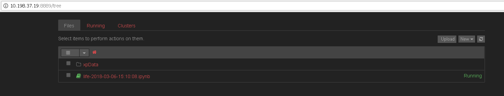

Clicking on the ipynb link, opens a interactive shell, with a summary of the profile.

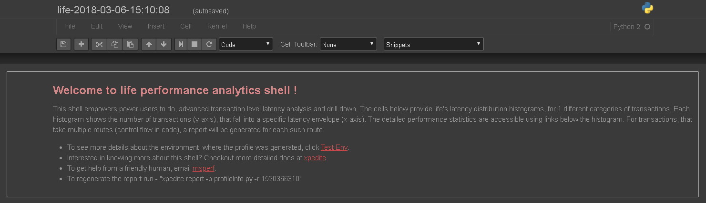

Below the summary, the report will include a histogram for latency distribution, plotting time in x-axis and transaction count in y-axis.
  
This visualisation is a good starting point for getting an overview of application's latency profile.

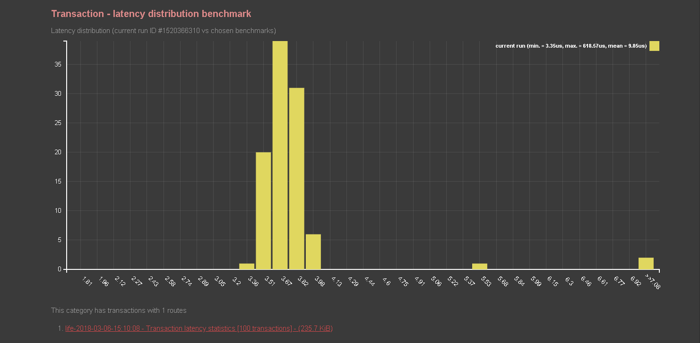


The shell also supports commands to filter, query and dynamically generate other visualisations to analyze profile data.
  
To run a new command

  1. First add an empty cell by clicking ```+``` button next to save file icon or pressing hot key ```b```
  2. Enter a xpedite shell commands or any valid python snippet
  3. To finally run the command, click the play icon or press hot key ```shift + enter```.

  
For instance, running xpedite command ```txns()``` will print a table with 100 transactions (as shown below).
    

Before you go any further, Let's take a moment to get familiar with a core xpedite concept.

#### Transaction

Transaction is any functionality in the program, that is a meaningful target for profiling and optimisations.
  
A transaction stores data (timestamps and h/w counters) from a collection of probes, that got hit, during program execution to achieve the functionality.
  
The transactions can be used to generate statistics and visualisations for total end to end latency, and latency between each pair of probes.
  
Let's look at, how profile info and instrumentation work together to build transactions, in the above program.
  
The method ```life()``` is instrumented at three places.

  1. XPEDITE_TXN_SCOPE(Life)
  2. XPEDITE_PROBE(SleepBegin)
  3. XPEDITE_PROBE(CodeBegin)

Each instantiation of ```XPEDITE_PROBE``` inserts one named probe (first argument) in the control flow.

Probe scope macros like ```XPEDITE_TXN_SCOPE``` however, inserts a pair of named probe. The first probe is inserted at the point of instrumentation, while the second one at the end of block scope(RAII).
  
With the above instrumentation in place, each iteration of the loop in ```life()```, will hit the following 4 probes in order.

  1. LifeBegin
  2. SleepBegin
  3. CodeBegin
  4. LifeEnd
  
Since we are interested in measuring loop iteration latency, the route ```LifeBegin -> SleepBegin -> CodeBegin -> LifeEnd``` is used to build transactions.
We expect to see 100 transactions, one per iteration of the loop.
  
The txns() command obliges by returning the table below with 100 rows (one row per transaction).
The columns in the table, matches the expected route, with control flowing from left to right.
Each cell in a row, shows the latency for execution of, code between the probe for the current column and the next one.
  
From the table, Let's see, how one can infer latency stats for a transaction. Looking at the first row, we can see the below stats for the first transaction
  
  1. Total time             - 618.572 us
  2. Time spent in eat()    - 615.559 us
  3. Time spent in sleep()  -   1.670 us
  4. Time spent in code()   -   1.343 us

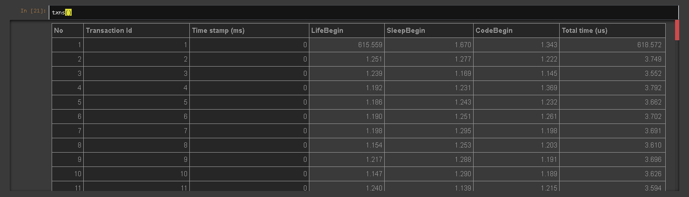

Now let's do something interesting. Instead of listing all transactions, let's just list outliers (transactions, that took longer than expected)
  
The command ```filter(lambda txn: txn.duration > 10)``` filters and lists transactions that took more than 10 us.
In my profile, the shell returned just one transaction (as shown below). 

Real production systems generate millions of transactions. This command will be quite handy to filter transactions of interest, based on arbitrary criteria.

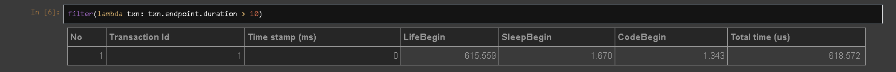

Enough of tables, Let's try some visualisation.
  
```plot()``` is useful to plot, latencies of all transactions in chronological order, with transaction id in x-axis and time (us) in y-axis.
  
Plots like these are useful, to spot patterns or trends in transaction latency over a period of time.
These patterns can provide interesting insights on application behaviour,  bottlenecks, impact of system level events like periodic interrupts etc.
  
In the chart below, it can be seen that, the outlier occurs at the beginning of the profile session. Such a pattern is a symptom of warm up issues in application.
  
In addition to total time, plots are generated for each pair of probes in the transaction.
The drop down menu at the top can be used to pick plots for different sections of code.

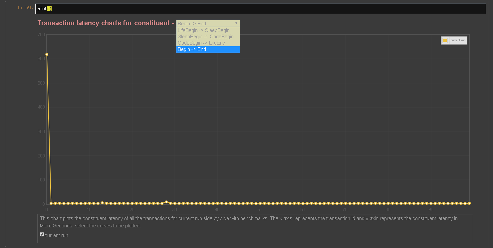

In plots with outliers, It's typical for worst transaction, to dominate the scale of the y-axis, hiding details of normal transactions.
  

In the above chart, the first transaction hides details of all other transactions.  Let's filter and plot, only transactions that took less than 10 micro seconds.
    
Chaining ```filter()``` with ```plot()```  like this ```filter(lambda txn : txn.duration < 10).plot()```, generates a more useful chart, that shows the latency trend across regular transactions.


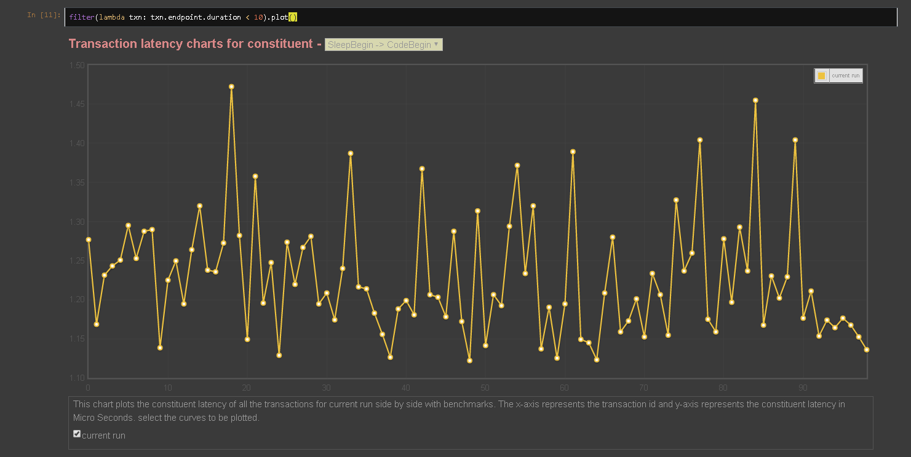

```plot()``` is a also useful to plot a single transaction, when supplied with transaction id as arugment.

Running ```plot(4)```, plots a hierarchical break up of latency statistics for fourth transaction, as shown below.

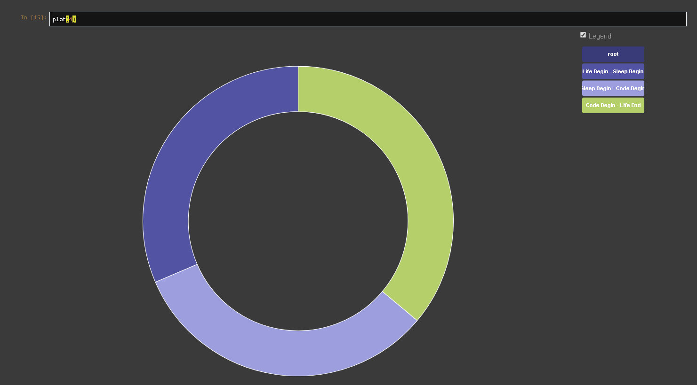

The commands described above are useful, to query/visualize profile data at trasaction level granularity. Let's now explore, how to generate statistics, for a group of transactions.
  
The ```stats()``` command generates total and probe level statistics, for all the transactions in the profile.
  
For the above program, running ```stats()``` renders a table with 4 rows. The statistics for end to end transaction latency is show at the last row.
The rest of rows provide statistics for different sections of code, between pair of probes, for all probes in the transaction.

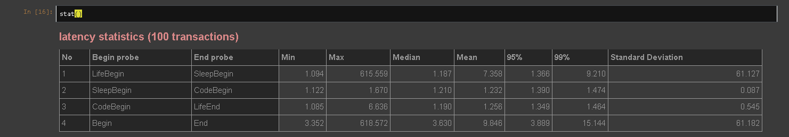

The max, 95%, 99% and standard deviation in the above table are skewed by inclusion of the huge outlier.
Let's see how to generate statistics, for a subset of transactions.
  
Combining ```filter()``` and ```stats()``` like this ```filter(lambda txn : txn.txnId > 50).stats()``` computes statistics for, all but the first 50 transactions.
Since the outlier is not included, we can see tighter latency statistics, compared to the previous table.

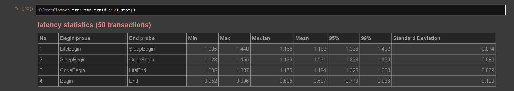

## Benchmarking <a name="benchmarking"></a>

Benchmarking is useful to compare performance statistics of different runs/builds side by side, to answers questions like the ones stated below.

  1. How effective is an optimisation compared to the unoptimised build ?
  2. Is the application running faster in next generation processor ? How much speed up or degradation ?

Benchmarks are created by serializing and storing profile data in some file system path, for future comparisons.
Benchmarks are also useful, in keeping a chronicle of all optimisations, implemented over a period of time.
  
Let's consider how to create a new benchmark, for a run of the above described application.

First pick file system path (to store the benchmark) and append a meaningful benchmark name to it.
The chosen path can then be used at profile creation time like this ```xpedite record -b``` | ```xpedite record --createBenchmark```), to create a new benchmark.
  
For instance, Running ```xpedite record``` as described in the previous section, with an additional parameter ```-b /tmp/baseline``` creates a new benchmark at ```/tmp/baseline```
  
Having created a baseline benchmark, Let's now consider how to use ```/tmp/baseline```, for comparison with a new run.
  
A profile can be compared with one or more benchmarks, by providing a list of paths in ```benchmarkPaths``` parameter of profileInfo.
Let's add ```/tmp/baseline``` to the list of ```benchmarkPaths```.

```python
  from xpedite import Probe, TxnBeginProbe, TxnEndProbe
  appName = 'Life'                      # Name of the application
  appHost = '127.0.0.1'                 # Host, where the application is running
  appInfo = '/tmp/xpedite-appinfo.txt'  # Path of the appinfo file

  probes = [
    TxnBeginProbe('Life Begin', sysName = 'LifeBegin'),     # Txn begins with probe 'LifeBegin', marks the beginning of 'eat()'
    Probe('Code Begin', sysName = 'CodeBegin'),             # Marks the beginning of 'code()'
    Probe('Sleep Begin', sysName = 'SleepBegin'),           # Marks the beginning of 'sleep()'
    TxnEndProbe('Life End', sysName = 'LifeEnd'),           # Txn ends with probe 'LifeEnd', marks the end of 'sleep()'
  ]

  benchmarkPaths = [
    '/tmp/baseline'
  ]
```

Recording a new profile with the updated profileInfo, will benchmark statistics for current run with baseline.
As shown below, the histogram for the new run, includes latency distribution of the baseline, in addition to the current run.

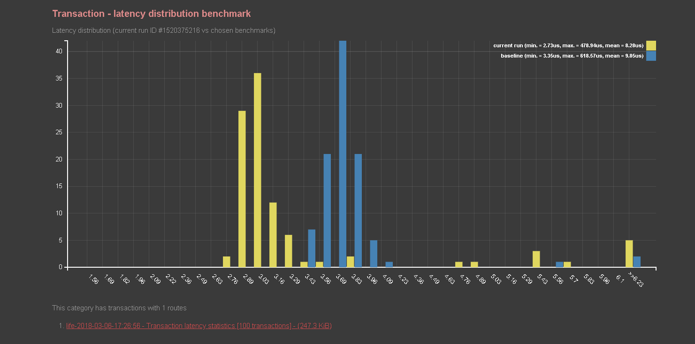

Side by side comparisons, are also generated in ```plot()``` results. 

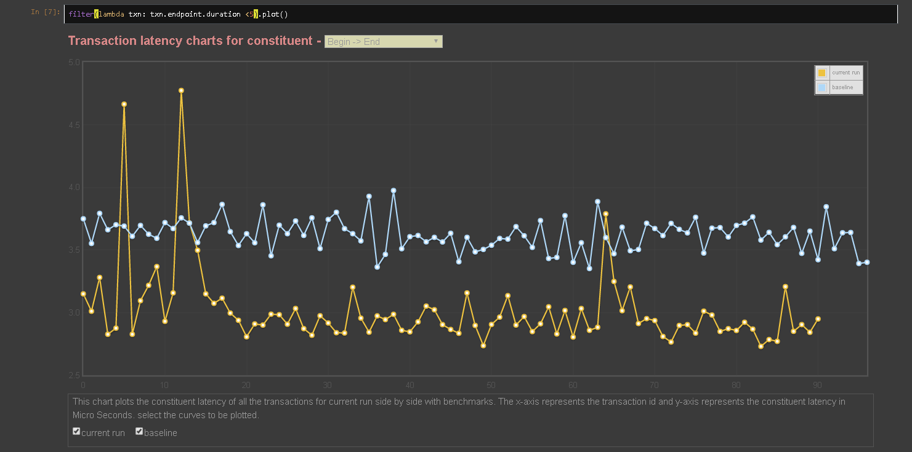

The ```stat()``` command goes one step further and generates side by side comparisons for each section of code (each table cell).
The stats for the current run are highlighted with reference to a benchmark. The improvements are highlighted with Green color and degradations in Red.
The difference between the current run and a benchmark is also give within parenthesis.

In reports with multiple benchmarks, the reference benchmark can be change by using the drop down at the top of the table.

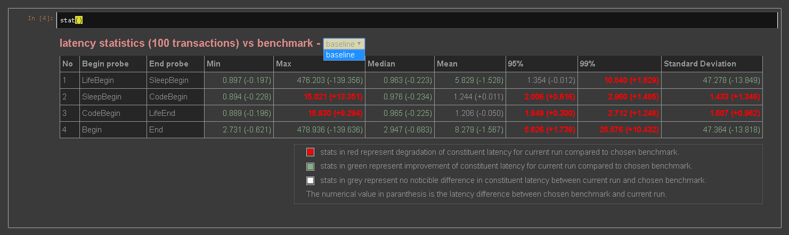


## Hardware performance counters <a name="pmc"></a>

Xpedite uses linux perf events api to program and collect hardware performance counters in the cpu.
To enable this feature, ensure cpu level event access is permitted for the current user running Xpedite.
Cpu level event access for all users can be enabled by setting /proc/sys/kernel/perf_event_paranoid to a value <=0.
More details can found at perf_event_paranoid section of the linux kernel documentation [here](https://www.kernel.org/doc/Documentation/sysctl/kernel.txt)

Xpedite can collect any of the core and offcore hardware performance counters, for bottleneck or topdown analysis.
The list of counters supported, depends on processor's micro architecture and can be listed by running ```xpedite list```
  
For instance, running ```xpedite list``` in my IVY Bridge server box, lists 355 pmc events as shown below.

```
FP_COMP_OPS_EXE.SSE_PACKED_SINGLE                            [0x00004010]      - Number of SSE* or AVX-128 FP Computational packed single-precision uops issued this cycle
UOPS_DISPATCHED_PORT.PORT_0_CORE                             [0x002001A1]      - Cycles per core when uops are dispatched to port 0
INST_RETIRED.ANY_P                                           [0x000000C0]      - Number of instructions retired. General Counter   - architectural event
OFFCORE_RESPONSE.PF_LLC_DATA_RD.LLC_HIT.SNOOP_MISS           [0xB7,0xBB|0x01] - Counts prefetch (that bring data to LLC only) data reads that hit in the LLC and the snoops sent to sibling cores return clean response
...
```


Let's consider, how to configure xpedite to program and collect data from hardware performance counters. 

Up to 8 pmc events can be programmed in modern Intel processors (Sandy Bridge and later), when hyper threading is disabled.
  
To get consistent results, threads under profile, must be pinned to one of the cpu cores, to prevent cpu migrations.
  
The list of pmc events and cpu cores (where the threads are pinned), can be configured in profileInfo as shown below.

```python
from xpedite import TopdownNode, Metric, Event

# List of performance counters to be collected for this profile
pmc = [
  TopdownNode('Root'),                                      # Top down analysis for Root node of the hierarchy
  Metric('IPC'),                                            # Instructions retired per cycle
  Event('kernel cycles',  'CPL_CYCLES.RING0'),              # Cycles spent in the kernel
  Event('Data L1 Miss',   'L2_RQSTS.DEMAND_DATA_RD_HIT'),   # Demand Data Read requests that hit L2 cache
  Event('Data L2 Miss',   'L2_RQSTS.DEMAND_DATA_RD_MISS'),  # Demand Data Read requests that miss L2 cache
]

# List of cpu, where the hardware performance counters will be enabled
cpuSet = [5]
```

The profileInfo (shown above), enables pmc collection at cpu core 5 ```cpuSet = [5]```. 
  
First start the target app (described above), using ```taskset -c 5 ./life``` to pin the main thread to core 5.
  
Once the app is running, Run ```xpedite record``` to attach the profiler and generate report with performance counter data.

The images below show, how xpedite reports are enriched, with data collected from hardware performance counters.
The overall structure of the report remains the same (as described in previous sections), with more details presented, where appropriate.

```txns()``` command generates transactions in a table, similar to the one shown above.
However doing mouse over on a table cell, reveals a popup showing performance counter data, for that section of code.

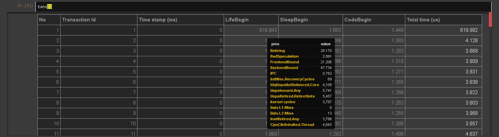

```stat()``` command generates a statistics table for each of the chosen counter, in addition to default timings statistics.
The tabs at the top of the table can be used to select stats for different counters.

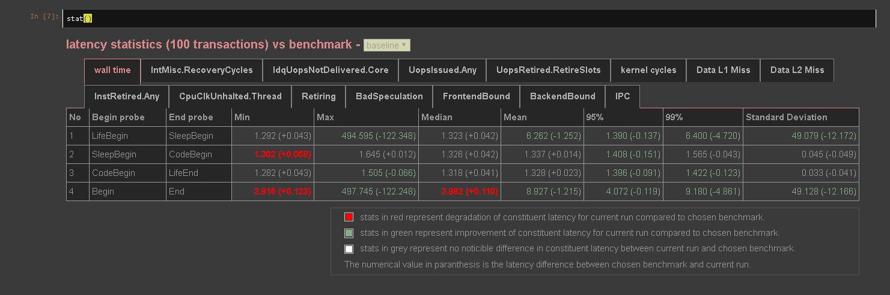

Plotting a transaction, generates a new visualisation showing the correlation between performance counters and sections of code.
For instance, plotting 4th transaction in my profile, generates the bipartite visualisation below.
The counters (each with a distinct color) is shown at the top, while the probes (sections of code) at the bottom.

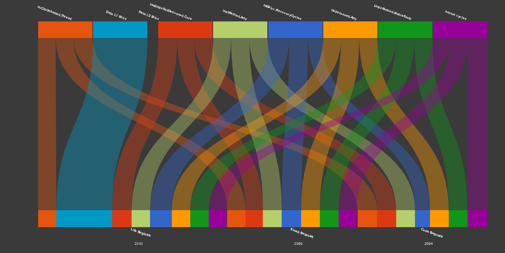

Moving mouse over a probe name, shows values of all the counters for that section of code.

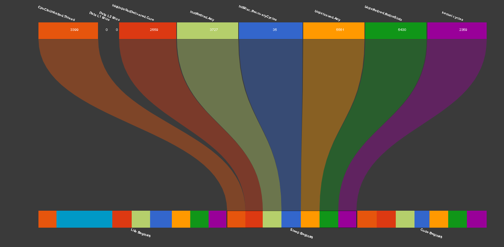

Alternatively, moving mouse over a counter name, shows the value of that counter at different sections of code.

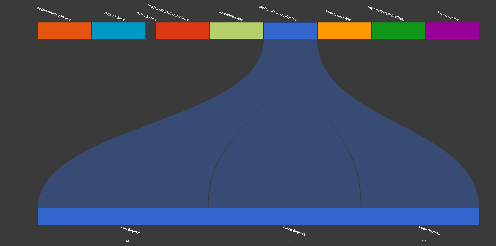


## Cycle Accounting <a name="cycleAccounting"></a>

Xpedite supports cycle accounting and bottleneck analysis using 
[top-down micro architecture analysis methodology](https://ieeexplore.ieee.org/document/6844459).
  
The topdown hierarchy for any micro architecture can be rendered to console with ```xpedite topdown``` command.
Nodes that need more than 8 general purpose counters are not supported and highlighted in Red.
  
The rest of the nodes, can be used directly with ```pmc``` parameter in profileInfo.
For instance, ```TopdownNode('Root')``` will provide a breakup of the following immediate children.
  
  1. Retiring
  2. BadSpeculation
  3. FrontendBound
  4. BackendBound

Given a topdown node, xpedite automatically resolves and enables the required performance counters, and generates statistics for topdown nodes in addition to performance counters.

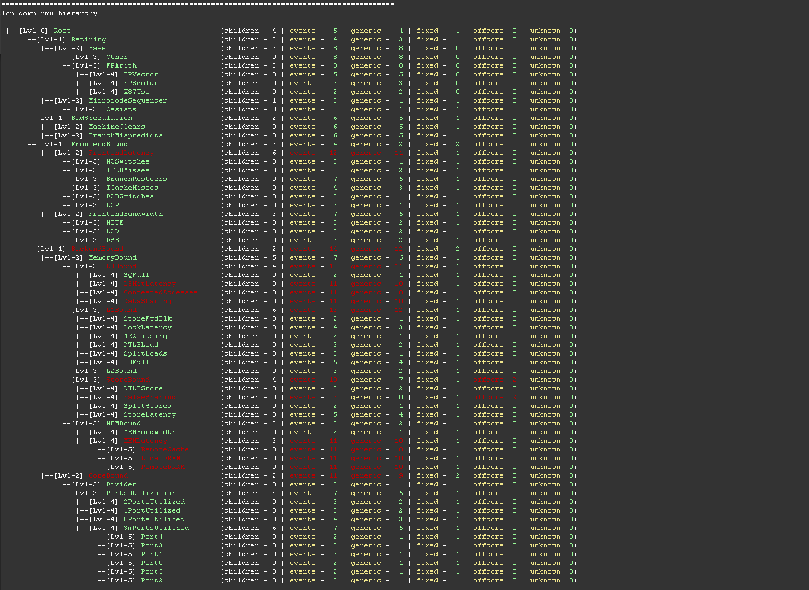

Xpedite also supports a few predefined metrics like IPC, CPI etc..  The list of supported metrics can be displayed with ```xpedite metrics``` command.

## Collaboration <a name="colloboration"></a>

Xpedite facilitates collaboration, by making it easy for developers to share, profile and analyze results with other developers.
  
The jupyter notebook (along with transaction data and visualisations) can be bundled into one tar file (```.tar.xp```) using ```xpedite shell zip``` command.

On the other hand, a xpedite tar file can be reopened using ```xpedite shell unzip``` command, with file name as parameter.


## Quality of life features <a name="qolFeatures"></a>

#### Auto generating profileInfo module

For applications instrumented with hundreds of probes, it can become a chore to hand code all the probes in the profileInfo module. 
  
Xpedite provides a handy command ```xpedite generate```, that can locating probes in an instrumented process, to generate the profileInfo module.

For instance, a profileInfo for the program (described above),  can be generated using command ```xpedite generate -a /tmp/xpedite-appinfo.txt```.
  
The ```profileInfo.py``` module is created in the current working directory.  The comments in the genreated file are also useful, as a documenation for various profileInfo parameters.

#### Snippets for commonly used commands

Xpedite shell generates a drop down at top right corner (shown below), with commonly used shell commands.
This is quite handy, if you can't recollect a command or the exact syntax for using one.
Clicking on an option, adds a new cell, with the command in place ready for execution.

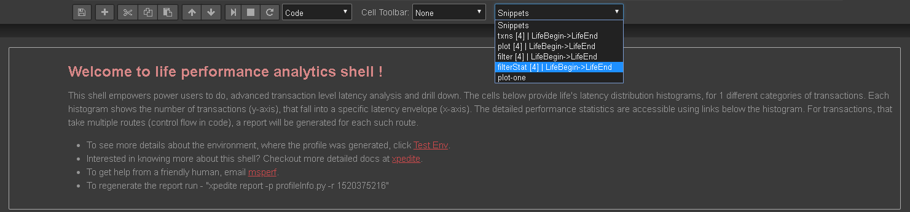

#### Profiling from a remote host

For production systems, it is a good practice to run xpedite in a host different from the production host, to avoid any potential interference.
  
Xpedite supports profiling applications running in any remote host, as long as a tcp connectivity is permitted.
Remote profiling can be enabled, by setting the appropriate remote host name in ```appHost``` parameter of the profileInfo module.

## Support <a name="support"></a>
Need Help ? Get in touch with Xpedite developers via email - msperf@morganstanley.com

## Acknowledgements <a name="acknowledgements"></a>

Xpedite was envisioned and developed by **[Manikandan Dhamodharan](http://www.linkedin.com/in/mani-d)**.
  

Thanks to **[Brooke Elizabeth Cantwell](https://www.linkedin.com/in/brookecantwell)**, **[Dhruv Shekhawat](http://www.linkedin.com/in/dhruvshekhawat)** for jupyter integration and test cases.
  

Special thanks to **Dileep Perchani** and **Kevin Elliott** for leading Xpedite open source initiative.
